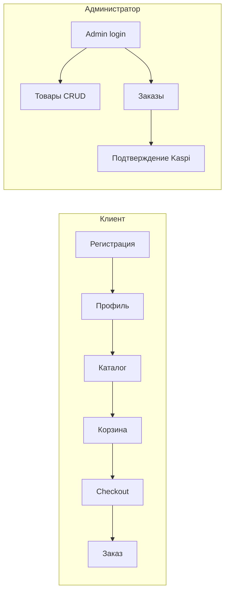
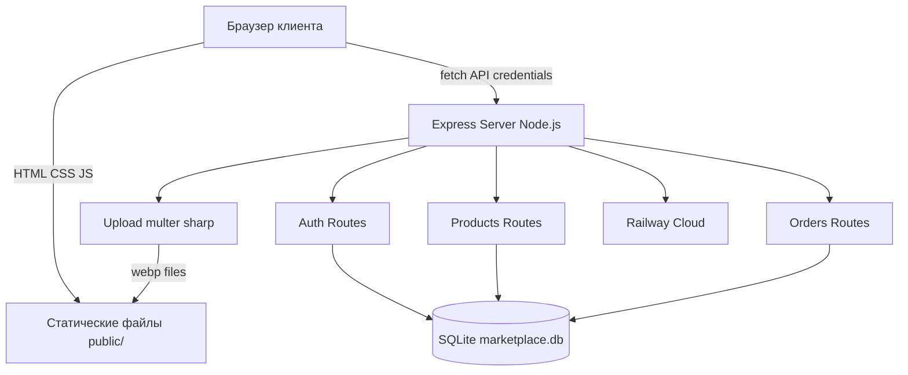
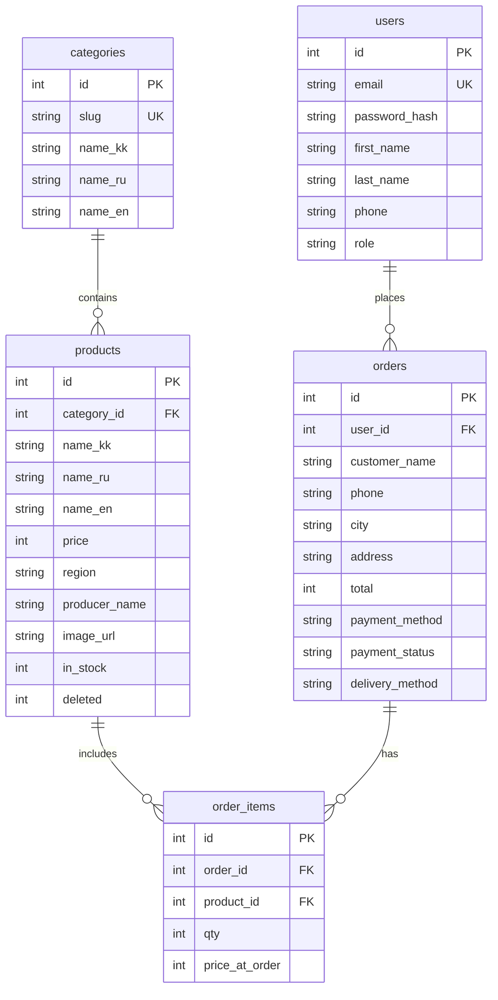
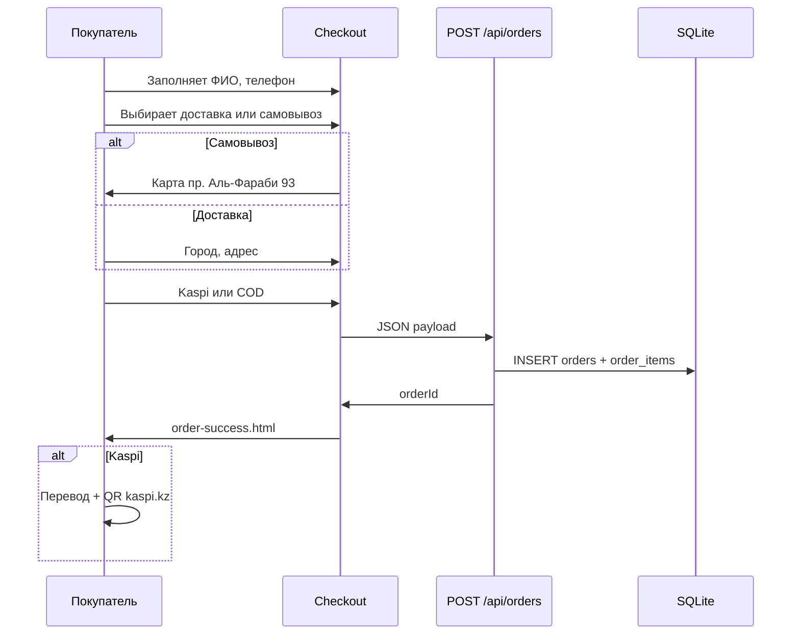

# 2 ПРОЕКТИРОВАНИЕ ВЕБ-МАРКЕТПЛЕЙСА QAZMARKET

## 2.1 Общая характеристика и целевая аудитория проекта

**QazMarket** — веб-маркетплейс (online marketplace) для продажи товаров, произведённых в Республике Казахстан. На каждой карточке указаны регион происхождения и название производителя.

**Целевая аудитория:**

| Группа | Потребности |
|--------|-------------|
| Покупатели | Удобный каталог отечественных товаров, понятная оплата (Kaspi), доставка или самовывоз |
| Производители / администратор | Простое добавление товаров с фото, управление наличием |
| Студент / разработчик | Демонстрация fullstack-проекта на защите диплома |

**Категории товаров** (предустановленные): продукты питания, текстиль, мёд и здоровье, ремесло.

## 2.2 Роли пользователей и функциональные возможности

### Роль «client» (покупатель)

- Регистрация (`/register.html`) по email и паролю
- Вход (`/login.html`)
- Заполнение профиля: фамилия, имя, телефон (`/account.html`)
- Просмотр каталога, добавление в корзину
- Оформление заказа с выбором доставки / самовывоза и Kaspi / COD
- Просмотр истории заказов в личном кабинете

### Роль «admin» (администратор)

- Вход только через `/admin-login.html` (учётная запись создаётся при старте сервера)
- Добавление товара (`/add-product.html`)
- Редактирование и удаление (`/manage-products.html`, `/edit-product.html`)
- Просмотр заказов и подтверждение Kaspi-оплаты (`/admin-orders.html`)

## 2.3 Проектирование архитектуры приложения

Приложение построено по архитектуре **клиент — сервер** с REST API.

**Уровни:**

1. **Presentation** — HTML-страницы, Tailwind CSS, Vanilla JS (`public/`)
2. **Application** — Express-маршруты (`server/routes/`)
3. **Data** — SQLite через better-sqlite3 (`data/marketplace.db`)

**Основные API-эндпоинты:**

| Метод | Путь | Назначение |
|-------|------|------------|
| POST | /api/auth/register | Регистрация клиента |
| POST | /api/auth/login | Вход |
| PATCH | /api/auth/profile | Обновление профиля |
| GET | /api/products | Каталог с фильтрами |
| POST | /api/products | Создание товара (admin) |
| PUT | /api/products/:id | Редактирование (admin) |
| DELETE | /api/products/:id | Удаление (admin) |
| POST | /api/orders | Создание заказа |
| GET | /api/orders/mine | Заказы клиента |
| GET | /api/orders/admin | Заказы (admin) |
| POST | /api/upload | Загрузка фото (admin) |

## 2.4 Проектирование базы данных SQLite

База данных нормализована до 3НФ. Файл схемы: `data/schema.sql`.

**Ключевые решения:**
- `products.deleted` — мягкое удаление (товар скрывается из каталога)
- `orders.payment_method` — `kaspi` | `cod`
- `orders.delivery_method` — `delivery` | `pickup`
- `orders.user_id` — nullable (гостевой заказ возможен, но профиль привязывается при входе)

## 2.5 Проектирование пользовательского интерфейса и навигации

**Страницы приложения:**

| Страница | URL | Доступ |
|----------|-----|--------|
| Главная | / | Все |
| Каталог | /catalog.html | Все |
| Товар | /product.html?id= | Все |
| Корзина | /cart.html | Все |
| Checkout | /checkout.html | Все |
| Успех заказа | /order-success.html | Все |
| Регистрация | /register.html | Все |
| Вход | /login.html | Все |
| Кабинет | /account.html | Client |
| Admin login | /admin-login.html | Admin |
| Управление товарами | /manage-products.html | Admin |
| Заказы | /admin-orders.html | Admin |

**Навигация:** шапка (логотип, главная, каталог, корзина, вход/кабинет), переключатель языка (Қaz / Рус / Eng), футер.

**Цветовая схема:** teal (#0d9488) — основной, gold — акцент, нейтральный серый фон.

## 2.6 Проектирование многоязычного интерфейса

Используется клиентская i18n-библиотека (`public/js/i18n.js`):

- JSON-файлы локализации: `public/locales/kk.json`, `ru.json`, `en.json`
- Атрибут `data-i18n="key"` на элементах HTML
- Выбор языка сохраняется в `localStorage`
- Названия товаров хранятся в БД в трёх полях: `name_kk`, `name_ru`, `name_en`

## 2.7 Проектирование сценариев оформления заказа

**Самовывоз:** фиксированный адрес «пр. Аль-Фараби, 93, Алматы», ссылка на карту 2GIS (`https://go.2gis.com/Pr8me`).

**Kaspi:** после заказа отображаются номер телефона получателя, сумма, комментарий `QazMarket #N`, QR на kaspi.kz.
